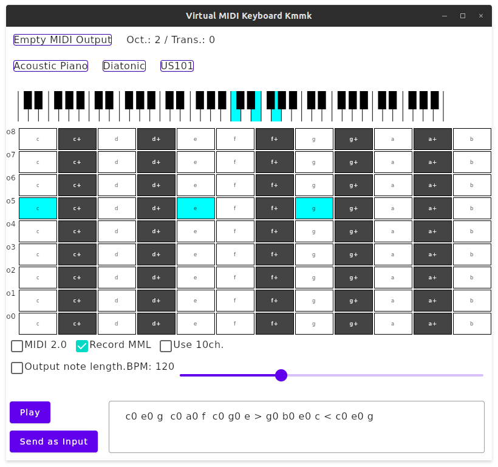
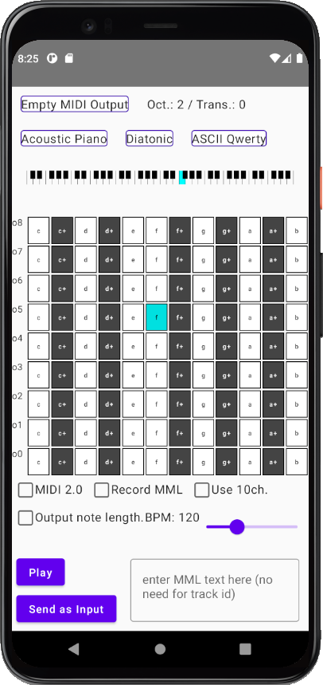

# Kmmk: virtual MIDI keyboard for Desktop and Android

Kmmk is a virtual MIDI keyboard application based on [ktmidi](https://github.com/atsushieno/ktmidi).

Here is the basics: it receives either keyboard inputs, mouse clicks or touch inputs, among whatever the underlying platform accepts. Then it sends note on/off operations etc. to the target MIDI output device.

Kmmk makes use of Kotlin Multiplatform and Jetpack Compose, and should run on Android and desktop i.e. Linux, Mac and most likely Windows (not verified).

## Features

Kmmk has various features.

### Works as a virtual MIDI Input

(Linux and Mac only) when kmmk is launched, it creates a virtual MIDI input port for itself so that any MIDI apps (e.g. DAWs) can use it as a virtual MIDI keyboard.

### Keyboard layouts

It supports two PC keyset layouts:

- Diatonic: like piano. When there is no semitone e.g. `e-sharp` or `b-sharp` then the corresponding key is left blank.
- Chromatic: every key has an assigned note. That means, the key right next to `e` is not `f` but `f+` because `f` is placed on right-upper next to `e`.

### PC keyboard settings

By default the keyboard is laid out as ASCII QWERTY sequence. We also provide some other keyboard layouts that extend the key ranges beyond QWERTY.

### Octave Shift and Note Shift (transpose)

SHIFT+UP increases octave, SHIFT+DOWN decreases it. SHIFT+LEFT decreases transpose, SHIFT+RIGHT increases it.

### Drum part

You can also choose "channel 10" which usually means a drum channel. For channel 10, it will show drum set names instead of instruments.

### Record MML

When you type "notes" then they will be recorded at the text entry box, as simple MML (Music Macro Language), implemented as in [mugene-ng](https://github.com/atsushieno/mugene-ng).

### Play MML

The recorded MML can be compiled as a MIDI sequence and then sent to the target MIDI output device, just like MIDI player does.

### Combination of all above

Those features can be powerful when they are combined together. For example, you can code some drum patterns as in MML, then play it and send the MIDI seqneunce to your DAW via the kmmk virtual MIDI input.

## License

kmmk is distributed under the MIT License.

